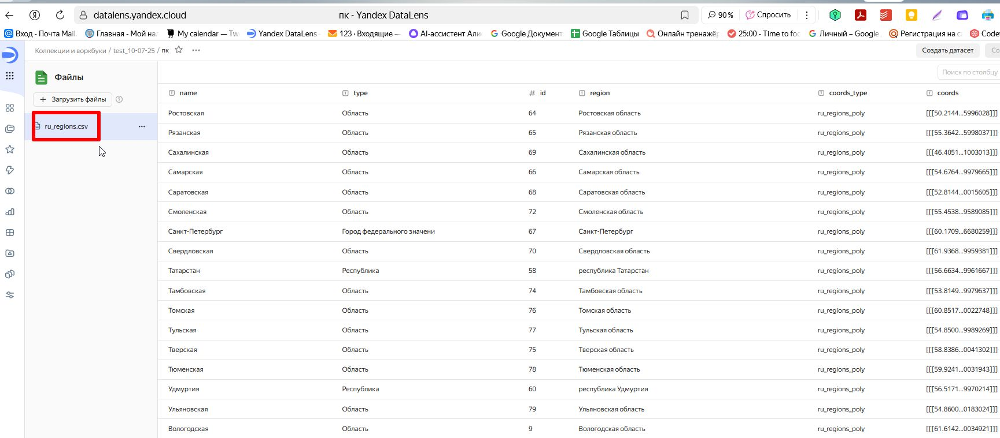

На данный момент задача на стопе. Для дальнейшей реализации необходимо: полигоны регионов РФ. Имеющиеся или работают в даталенз и не работают c питоном или работают с питоном, но не работают с даталенз. 
Проект реализован не до конца. 

В даталенз - (открывать под учеткой) https://datalens.yandex.cloud/workbooks/f4q6ek6g4qlo0
для карты найден датасет но без ДНР - эти данные не грузятся в ноутбук - ошибка кодировки.

 \n
 \n
 \n
